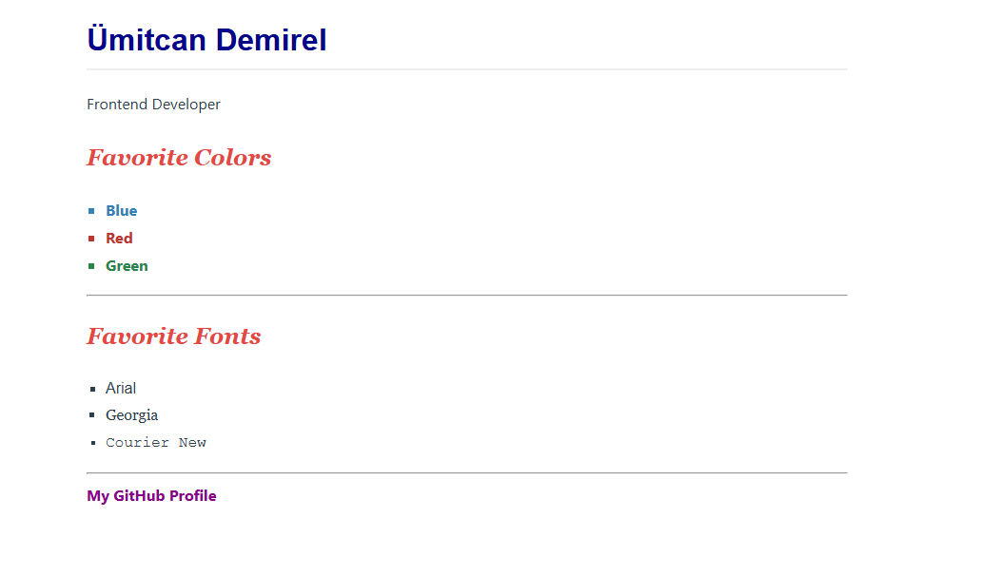

# 02 - Typography and Color Guide / Tipografi ve Renk Rehberi

[EN] This project is a comprehensive study on web typography, font hierarchies, and the professional use of color palettes in CSS.
[TR] Bu proje; web tipografisi, font hiyerarşileri ve CSS'te profesyonel renk paleti kullanımı üzerine kapsamlı bir çalışmadır.

## 🖼️ Preview / Önizleme

## 🎯 Key Features / Önemli Özellikler

### 🇬🇧 English
* **Typography Anatomy:** Explored the differences between Serif, Sans-Serif, and Monospace font families.
* **Color Systems:** Implemented professional color schemes using HEX codes instead of basic color names.
* **Advanced Selectors:** Used the `:nth-child()` pseudo-class to style specific list elements dynamically.
* **Readability:** Optimized `line-height`, `letter-spacing`, and `max-width` for a better user reading experience.

### 🇹🇷 Türkçe
* **Tipografi Anatomisi:** Serif, Sans-Serif ve Monospace font aileleri arasındaki farklar incelendi.
* **Renk Sistemleri:** Temel renk isimleri yerine profesyonel HEX kodları kullanılarak renk şemaları uygulandı.
* **Gelişmiş Seçiciler:** Liste öğelerini dinamik olarak stilize etmek için `:nth-child()` sözde sınıfı kullanıldı.
* **Okunabilirlik:** Kullanıcı deneyimini artırmak amacıyla `line-height`, `letter-spacing` ve `max-width` değerleri optimize edildi.

## 🛠️ Technical Stack / Teknolojiler
* **HTML5** (Structural Hierarchy)
* **CSS3** (Typography, Color Theory, Pseudo-classes)

## 💡 Developer Note / Geliştirici Notu
[EN] In this lab, I learned how typography choices significantly impact a website's mood and how to use advanced CSS selectors to keep the HTML clean while applying unique styles.
[TR] Bu laboratuvar çalışmasında, tipografi seçimlerinin bir web sitesinin havasını nasıl etkilediğini ve HTML'i temiz tutarak özel stiller uygulamak için gelişmiş CSS seçicilerinin nasıl kullanılacağını öğrendim.