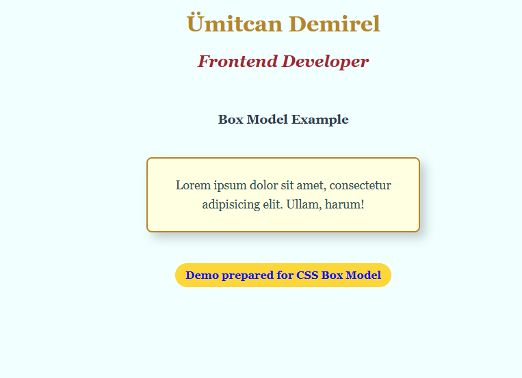

# 04 - Box Model Lab / Kutu Modeli Laboratuvarı

[EN] This project is a dedicated study on the CSS Box Model, the fundamental principle that determines how every element on a web page is sized and spaced.
[TR] Bu proje; web sayfasındaki her bir öğenin nasıl boyutlandırıldığını ve boşluklandırıldığını belirleyen temel prensip olan CSS Kutu Modeli (Box Model) üzerine özel bir çalışmadır.

## 🖼️ Preview / Önizleme

## 🎯 Key Features / Önemli Özellikler

### 🇬🇧 English
* **The Four Layers:** Visualized and experimented with Content, Padding, Border, and Margin.
* **Box-Sizing Fix:** Implemented `box-sizing: border-box;` to ensure consistent sizing across different elements.
* **Centering Techniques:** Mastered horizontal centering using `margin: auto;` for block-level elements.
* **Interactive Feedback:** Added hover effects that manipulate shadows and positioning to demonstrate depth.

### 🇹🇷 Türkçe
* **Dört Katman:** İçerik (Content), İç Boşluk (Padding), Kenarlık (Border) ve Dış Boşluk (Margin) katmanları görselleştirildi.
* **Boyutlandırma Çözümü:** Farklı öğeler arasında tutarlı boyutlandırma sağlamak için `box-sizing: border-box;` uygulandı.
* **Ortalama Teknikleri:** Blok düzeyindeki öğeler için `margin: auto;` kullanarak yatayda ortalama tekniği pekiştirildi.
* **Etkileşimli Geribildirim:** Derinliği göstermek için gölge ve konumlandırmayı değiştiren hover (üzerine gelme) efektleri eklendi.

## 🛠️ Technical Stack / Teknolojiler
* **HTML5** (Semantics)
* **CSS3** (Box Model, Box-Shadows, Transitions, Box-Sizing)

## 💡 Developer Note / Geliştirici Notu
[EN] Understanding that every element is essentially a box is a turning point in CSS. Using `border-box` is a best practice that simplifies layout calculations significantly.
[TR] Her öğenin aslında bir kutu olduğunu anlamak CSS'te bir dönüm noktasıdır. `border-box` kullanmak, yerleşim hesaplamalarını önemli ölçüde basitleştiren en iyi uygulama (best practice) yöntemidir.