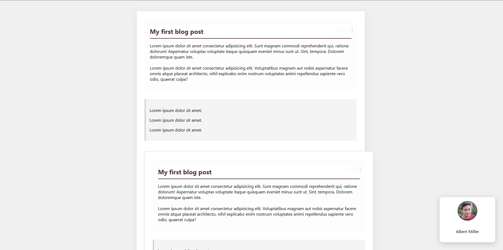

# 07 - Advanced Positioning Lab / İleri Düzey Konumlandırma

[EN] This project is a deep dive into CSS positioning mechanics, exploring how to break elements out of the normal document flow to create complex and interactive layouts.
[TR] Bu proje; karmaşık ve etkileşimli yerleşimler oluşturmak için öğeleri normal doküman akışından nasıl çıkaracağımızı inceleyen, CSS konumlandırma mekanikleri üzerine derinlemesine bir çalışmadır.

## 🖼️ Preview / Önizleme

## 🎯 Key Features / Önemli Özellikler

### 🇬🇧 English
* **Relative vs. Absolute:** Created a coordinate system by using `position: relative` on parents and `position: absolute` on children (e.g., the date tag).
* **Fixed Elements:** Implemented a persistent "Author Box" using `position: fixed` that stays visible regardless of scrolling.
* **Sticky Headers:** Used `position: sticky` for blog titles to enhance user experience during long reads.
* **Z-Index Management:** Controlled the stacking order of overlapping elements to ensure UI clarity.

### 🇹🇷 Türkçe
* **Relative ve Absolute İlişkisi:** Ebeveynlerde `relative`, çocuklarda `absolute` kullanarak (örneğin tarih etiketi) özel bir koordinat sistemi oluşturuldu.
* **Sabit Öğeler:** Sayfa kaydırılsa bile görünür kalan, `position: fixed` ile sabitlenmiş bir "Yazar Kutusu" uygulandı.
* **Yapışkan Başlıklar:** Uzun okumalarda kullanıcı deneyimini artırmak için blog başlıklarında `position: sticky` kullanıldı.
* **Z-Index Yönetimi:** Üst üste binen öğelerin katman sırası, arayüz netliğini sağlamak için kontrol edildi.

## 🛠️ Technical Stack / Teknolojiler
* **HTML5** (Semantics & Structural Containers)
* **CSS3** (Positioning, Shadowing, Overlays, Z-Index)

## 💡 Developer Note / Geliştirici Notu
[EN] Mastery of the "Positioning" property is what separates basic layouts from advanced UI designs. Understanding that an absolute element searches for its nearest relative parent is the key to pixel-perfect designs.
[TR] "Positioning" (Konumlandırma) özelliğinde uzmanlaşmak, temel yerleşimleri gelişmiş arayüz tasarımlarından ayıran unsurdur. Absolute bir öğenin en yakın relative ebeveynini aradığını anlamak, piksel hassasiyetinde tasarımların anahtarıdır.