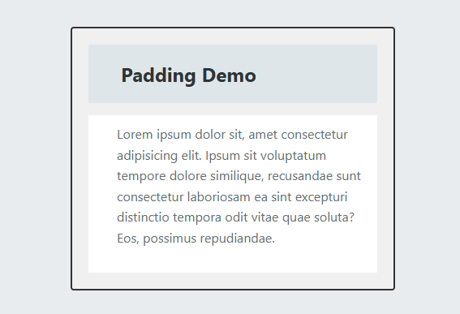

# 06 - Content Flow and Floats / İçerik Akışı ve Kaydırmalar

[EN] This project explores the traditional CSS Float property, focusing on how to manipulate the document flow and allow text to wrap around images effectively.
[TR] Bu proje; doküman akışını nasıl yöneteceğimizi ve metnin görseller etrafında etkili bir şekilde kaymasını sağlayan geleneksel CSS Float özelliğini incelemektedir.

## 🖼️ Preview / Önizleme

## 🎯 Key Features / Önemli Özellikler

### 🇬🇧 English
* **Text Wrapping:** Mastered how to float images to the left/right to create magazine-style layouts.
* **The Clearfix Hack:** Implemented the `::after` pseudo-element technique to prevent parent container collapse.
* **Document Flow:** Understanding how floated elements are removed from the normal flow while still affecting inline content.
* **Spacing & Margins:** Fine-tuned the balance between images and surrounding text for better legibility.

### 🇹🇷 Türkçe
* **Metin Kaydırma:** Magazin tarzı yerleşimler oluşturmak için görselleri sola/sağa kaydırma (float) tekniği pekiştirildi.
* **Clearfix Çözümü:** Kapsayıcı elemanların çökmesini (collapse) önlemek için modern `::after` yalancı öğe tekniği uygulandı.
* **Doküman Akışı:** Float edilen öğelerin normal akıştan nasıl çıktığını ve satır içi içeriği nasıl etkilediği kavrandı.
* **Boşluk Yönetimi:** Görseller ve çevreleyen metin arasındaki denge, okunabilirliği artırmak için optimize edildi.

## 🛠️ Technical Stack / Teknolojiler
* **HTML5** (Semantics & Media)
* **CSS3** (Floats, Clearfix, Pseudo-elements, Margin collapse)

## 💡 Developer Note / Geliştirici Notu
[EN] Even in the age of Flexbox and Grid, floats are still the best way to handle text-wrapping around images. Learning to "clear" floats is a rite of passage for every CSS developer.
[TR] Flexbox ve Grid çağında bile, metnin görsel etrafında dönmesini sağlamak için hala en iyi yol float kullanımıdır. Float'ları "temizlemeyi" (clear) öğrenmek, her CSS geliştiricisi için bir geçiş ayinidir.