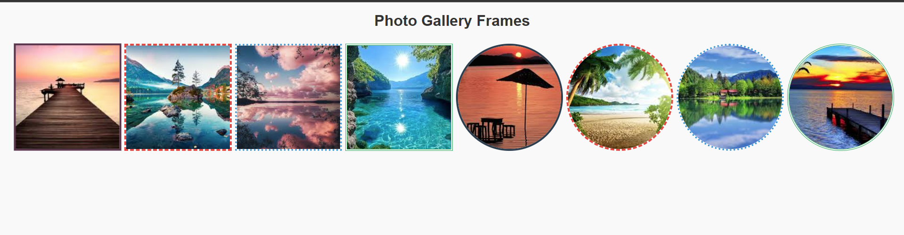

# 10 - Photo Gallery Frames / Fotoğraf Galerisi Çerçeveleri

[EN] This sub-project focuses on the diverse styles of CSS borders and the creative application of `border-radius` within a responsive grid layout.
[TR] Bu alt proje; CSS kenarlıklarının çeşitli stillerine ve bir duyarlı (responsive) ızgara düzeni içinde `border-radius` özelliğinin yaratıcı kullanımına odaklanmaktadır.

## 🖼️ Preview / Önizleme

## 🎯 Key Features / Önemli Özellikler

### 🇬🇧 English
* **Border Style Diversity:** Implemented multiple border-style properties (`solid`, `dashed`, `dotted`, `double`) to demonstrate visual boundary options.
* **Responsive Grid Logic:** Utilized `auto-fit` and `minmax` to create a fluid layout that adapts to any screen size.
* **Shape Transformation:** Applied `border-radius: 50%` to demonstrate the conversion of square containers into perfect circles.
* **Visual Interaction:** Integrated CSS transitions to provide real-time feedback during user hover states.

### 🇹🇷 Türkçe
* **Kenarlık Stili Çeşitliliği:** Görsel sınır seçeneklerini sergilemek için çoklu border-style özellikleri (`solid`, `dashed`, `dotted`, `double`) uygulandı.
* **Duyarlı Izgara Mantığı:** Her ekran boyutuna uyum sağlayan akışkan bir yerleşim için `auto-fit` ve `minmax` kullanıldı.
* **Form Dönüşümü:** Kare kapsayıcıların kusursuz dairelere dönüştürülmesini göstermek için `border-radius: 50%` uygulandı.
* **Görsel Etkileşim:** Kullanıcı hover (üzerine gelme) durumlarında gerçek zamanlı geri bildirim sağlamak için CSS geçişleri entegre edildi.

## 🛠️ Technical Stack / Teknolojiler
* **HTML5** (Semantics)
* **CSS3** (CSS Grid, Border-Style, Border-Radius, Transitions)

## 💡 Developer Note / Geliştirici Notu
[EN] "Grid layouts provide the structure, but borders and radius provide the visual delight." This lab bridges the gap between layout engineering and UI aesthetics.
[TR] "Izgara yerleşimleri yapıyı sağlar; ancak kenarlıklar ve yuvarlama efektleri görsel zevki oluşturur." Bu laboratuvar, yerleşim mühendisliği ile UI estetiği arasındaki köprüyü kurmaktadır.