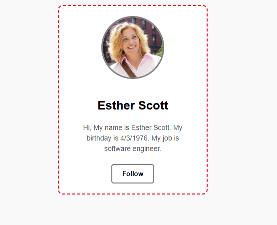

# 10 - Profile Card Design / Profil Kartı Tasarımı

[EN] This sub-project focuses on the practical application of border styles and radius properties within a specific UI component, highlighting interactive hover states.
[TR] Bu alt proje; kenarlık stillerinin ve radius özelliklerinin belirli bir UI bileşeni içindeki pratik uygulamasına odaklanarak, etkileşimli hover durumlarını vurgulamaktadır.

## 🖼️ Preview / Önizleme

## 🎯 Key Features / Önemli Özellikler

### 🇬🇧 English
* **Circular Avatar Transformation:** Applied `border-radius: 50%` to standard images to create perfectly circular profile frames.
* **Component Boundaries:** Utilized dashed border patterns to define card containers as a distinct visual unit.
* **Dynamic Feedback:** Engineered hover transitions that modify `border-width` and `border-color` for an enhanced tactile feel.
* **Text Rhythm:** Managed internal padding and margins to ensure typographic legibility within a restricted width.

### 🇹🇷 Türkçe
* **Dairesel Avatar Dönüşümü:** Kusursuz dairesel profil çerçeveleri oluşturmak için standart görsellere `border-radius: 50%` uygulandı.
* **Bileşen Sınırları:** Kart kapsayıcılarını belirgin bir görsel birim olarak tanımlamak için kesikli (dashed) kenarlık desenleri kullanıldı.
* **Dinamik Geri Bildirim:** Gelişmiş bir temas hissi için `border-width` ve `border-color` değerlerini değiştiren hover geçişleri tasarlandı.
* **Metin Ritmi:** Kısıtlı bir genişlik içinde tipografik okunabilirliği sağlamak için iç boşluk (padding) ve margin yönetimi yapıldı.

## 🛠️ Technical Stack / Teknolojiler
* **HTML5** (Semantic Containers)
* **CSS3** (Border-Radius, Dynamic Borders, Transitions, Box-Sizing)

## 💡 Developer Note / Geliştirici Notu
[EN] "Interaction design is built on visual feedback. A simple border-color change on hover tells the user: 'This element is alive'."
[TR] "Etkileşim tasarımı görsel geri bildirim üzerine kuruludur. Hover durumunda basit bir kenarlık rengi değişimi kullanıcıya şu mesajı verir: 'Bu öğe canlı'."