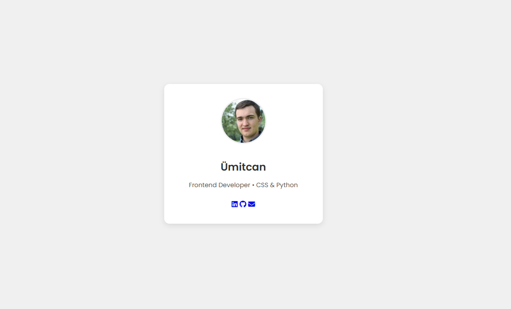

# 11 - Web Fonts and Iconography / Web Yazı Tipleri ve İkonografi

[EN] This lab explores the integration of external font families (Google Fonts) and vector icons (Font Awesome) to enhance typography and visual communication in UI components.
[TR] Bu laboratuvar, UI bileşenlerinde tipografiyi ve görsel iletişimi güçlendirmek için harici yazı tipi ailelerinin (Google Fonts) ve vektörel ikonların (Font Awesome) entegrasyonunu incelemektedir.

## 🖼️ Preview / Önizleme

## 🎯 Key Features / Önemli Özellikler

### 🇬🇧 English
* **External Font Integration:** Utilized Google Fonts API to implement 'Poppins', ensuring consistent cross-browser typography.
* **Scalable Iconography:** Integrated Font Awesome 6.x for resolution-independent icons that maintain clarity at any scale.
* **Semantic Components:** Used `article` and descriptive `aria-label` tags to improve accessibility (A11y) and SEO.
* **Visual Hierarchy:** Established a clear typographic rhythm using different font weights and icon sizing.

### 🇹🇷 Türkçe
* **Harici Font Entegrasyonu:** Tarayıcılar arası tutarlı tipografi sağlamak için Google Fonts API üzerinden 'Poppins' yazı tipi uygulandı.
* **Ölçeklenebilir İkonografi:** Her boyutta netliğini koruyan, çözünürlükten bağımsız ikonlar için Font Awesome 6.x entegre edildi.
* **Semantik Bileşenler:** Erişilebilirliği (A11y) ve SEO'yu artırmak için `article` ve açıklayıcı `aria-label` etiketleri kullanıldı.
* **Görsel Hiyerarşi:** Farklı font ağırlıkları ve ikon boyutlandırmaları kullanılarak net bir tipografik ritim oluşturuldu.

## 🛠️ Technical Stack / Teknolojiler
* **HTML5** (Semantics, Accessibility)
* **CSS3** (Typography, Flexbox, External Assets)
* **External APIs** (Google Fonts, Font Awesome)

## 💡 Developer Note / Geliştirici Notu
[EN] "Typography is 95% of the web. Icons are the universal language that guides the user where text fails."
[TR] "Web'in %95'i tipografidir. İkonlar ise metnin yetersiz kaldığı yerde kullanıcıya yol gösteren evrensel bir dildir."